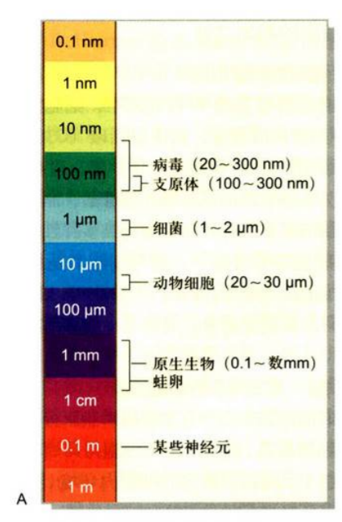

# Chapter 1 绪论

## 细胞的同一性与多样性

### 细胞是生命活动的基本单位

#### 基本共性

- 相似的化学元素组成 （C, H, O, N, P, S, etc.）
- 均由磷脂双分子层与蛋白质构成细胞质膜
- 相同遗传装置  
  DNS 遗传信息载体  
  RNA 转录物质知道合成  
  核糖体 蛋白质合成场所  
  除原生生物，细胞使用几乎相同的遗传密码
- 一分为二的分裂方式

#### 细胞大小

细胞大小取决于核糖体活性

能够独立生存的最小的生命体是支原体（mycoplast），直径为 0.1-0.3 um

#### 细胞是生命活动的基本单位

- 一切有机体都由细胞组成，细胞是构成有机体的基本单位
- 细胞是代谢与功能的基本单位
- 细胞是有机体生长发育的基础
- 细胞是繁殖的基本单位，是遗传的桥梁
- 细胞是生命起源的标志，是生物演化的起点

## 细胞的基本类型

### 类群

细胞结构的茶叶提可以分为真核细胞（eukaryotic cell）和原核细胞（prokaryotic cell）。

其将生物界划分为原核生物（prokaryote）和真核生物（eukaryote）两大类群。原核生物基本由单个原核细胞组成，而真核生物可以分为单细胞真核生物与多细胞真核生物。

- 原核生物
  - 单个原核细胞组成
- 真核生物
  - 单细胞真核生物
  - 多细胞真核生物
- 古核生物

在原核细胞种的古核细胞（aka 古细菌，archaea），其遗传信息表达系统与其他原核细胞差别大，与真核细胞接近，固独立。由其组成的生物是古核生物（archaeon）。

### 代表性原核细胞：细菌与蓝藻

原核细胞是一种原始的细胞类群，一般体积小，直径 0.2-10 um，繁殖快，适应性好。但是其基因量少，无法复杂的细胞分化。

其包含支原体，衣原体，立克次氏体，细菌，放线菌和蓝藻等多个家族。

#### 细胞

##### 基本结构

- 组成细胞的细胞壁
  - 细胞质膜
  - 核糖体
  - 核区
  - etc.
- 特化结构
  - 中魔体
  - 莱膜
  - 鞭毛
  - etc.

所有细菌具有共同的成分 **肽聚糖**。青霉素可以一直肽聚糖合成。  
革兰氏阳性菌（G\*）因细胞壁含肽聚糖高，对青霉素敏感，反之亦然。

细菌的细胞质膜包含选择性交换物质功能，其膜上丰富的酶系执行代谢功能。e.g. 氧气呼吸，蛋白质合成与分泌，细胞壁合成，etc.。因此其承担内质网，线粒体，高尔基体的部分功能。

鞭毛（flagellum）直径~20nm，结构与真核完全不同，其仅有一种鞭毛蛋白（flagellin）构成，运动机理不同。

细菌细胞包含 5,000-50,000 个核糖体，沉降系数为 70S。除核糖体外，无类似真核细胞的细胞器。

没有核膜围绕的细胞核，但是有明显的核区或类核（nucleoid）。  
核区形状不固定，DNA在**拟合蛋白**的协助下进行高速包装。

细胞核区 DNA 称为染色体，实际上没有真正染色体结构，习惯上沿用真核细胞的染色体概念。

##### 细菌基因组与遗传信息表达体系

其基因组小，为环状 DNA。一般有一个复制起点，复制时，细胞 DNA 环附在细菌质膜上作为支持点，复制不受细胞分裂周期的限制，可持续进行。

细菌 DNA 复制，RNA 转录 与 蛋白质合成的结构装置在空间上没有分隔，可以同时进行（i.e. 边复制边转录）。转录和翻译在时间上和空间上连续进行，其是原核细胞与真核细胞最显著差异之一。

质粒（plasmid），细菌细胞内存在可进行自主复制的更小环状 DNA 分子。细胞失去质粒 DNA 不会影响正常代谢活动。常用于基因重组和基因转移载体。

##### 细菌的繁殖

细胞周期比 DNA 复制时间短。DNA 复制未完成下一次复制已开始。

细菌的细胞分裂受到严格管控，起始 DNA 分离的关键蛋白 FtsZ （Filamenting temperature-sensitive mutant Z）。其与真核细胞中的管蛋白（tubulin）是同源物，其功能类似于微丝。

#### 蓝藻

又名蓝细胞（cyanobacteria），是自养型原核生物，可进行光合作用放出 O2.

体积比其他原核细胞大，直径 1-10 um，可达 60 um。

##### 细胞结构

质膜外有细胞壁和一层胶质的鞘。细胞壁由薄肽聚糖组成，外包由外膜。细胞壁内由纤维素。

细胞质有通心环样的膜片层结构，为类囊体（thylakoid）。光合色素，电子传递链位于此。  
类囊体膜有大量藻胆蛋白构成的藻胆体，用于将光能传递给叶绿素 a。

中心质/中央体是DNA所在部位。其DNA几乎裸露，复制可连续进行。

##### 细胞分裂与分化

分裂时，中部向内长出新横隔壁，将中心质与原生质分为两半。  
一般情况，两个子细胞在一个公共的胶质鞘包围下保持在一起并分裂形成丝状，片状等多细胞群体。

丝状在氮源不足时，5-10%细胞分化为异体胞（heterocyst）。其中固氮酶以光系统 I 制造的ATP为能源，将N2 还原为 NH3.

#### 古核细胞（古细胞）

原核细胞并不是统一类群，分为两类：古细胞（archaebacteria）与真细胞（eubacteria）。

常发现于极端特殊环境。最早发现是 产甲醛细菌类，之后盐细胞（halobacteria，生长在浓度大盐水中），热源质体（thermoplassma，生长在煤堆中），硫氧化菌（sulfolobus，生长在硫磺温泉中）等。

细胞大小在 0.1-15 um，以分裂或出芽方式增殖。

##### 细胞壁

染色呈 G\* 或 G- 但没有胞壁酸和肽聚糖。因此溶菌酶和青霉素等抗生素无效。

##### 细胞质膜

质膜时由脂类和蛋白质构成。其脂肪酸是以醚键与甘油组合。  
膜脂中有特殊中性脂质，鲨烯衍生物。

极端耐热菌的质膜是由40个碳长的四乙醚组成的单层膜。

##### DNA与其基因结构

DNA为环状吗，由操纵子结构。大部分基因无内含子，有多顺反子 mRNA，与细菌相似。

其类似于真核细胞类似。DNA和组蛋白结合成类似核小体结构编码 tRNA 与 rRNA，部分编码蛋白质的基因有内含子。RNA聚合酶为复杂多聚体，翻译起始的氨基酸为Met（细菌为 fMet）等。

##### 核糖体

多数古细菌类核糖体也是 70S，但含有 60 种以上蛋白，介于真核细胞与真细胞之间。但是其中rRNA与蛋白质性质更接近于真核生物。